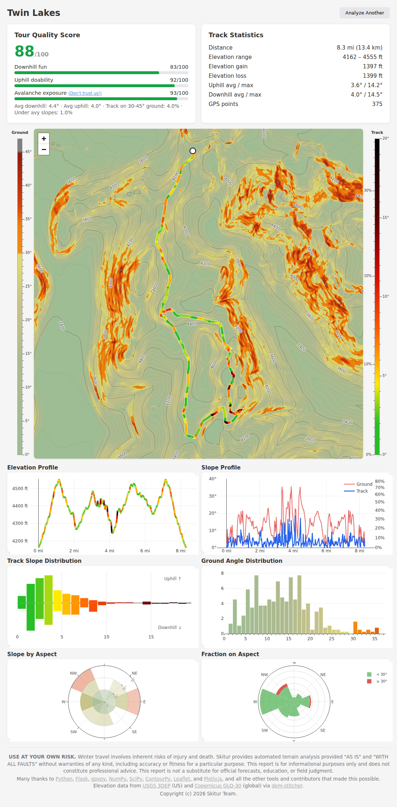
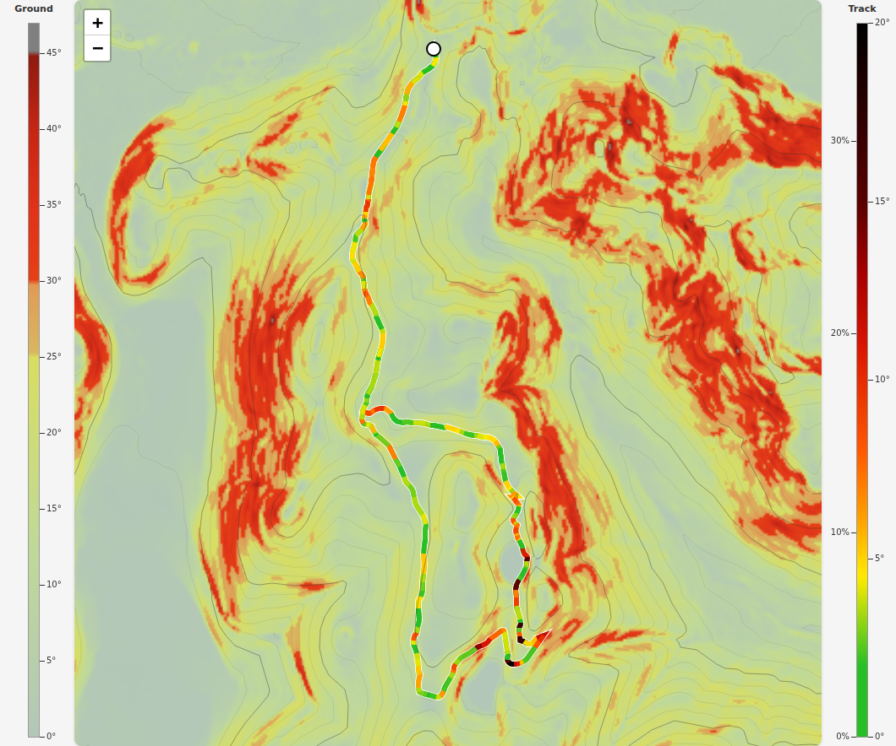
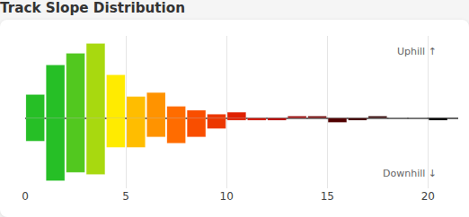
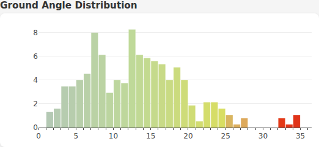
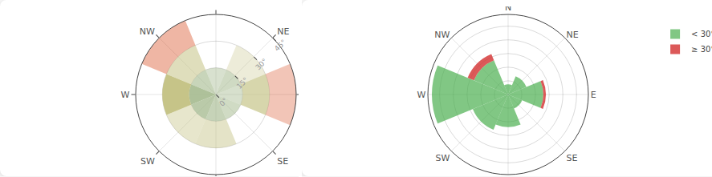
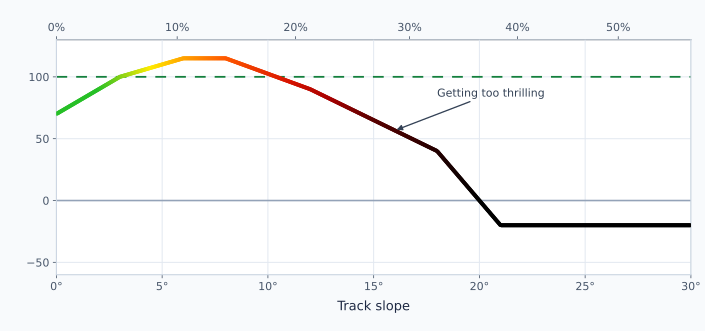
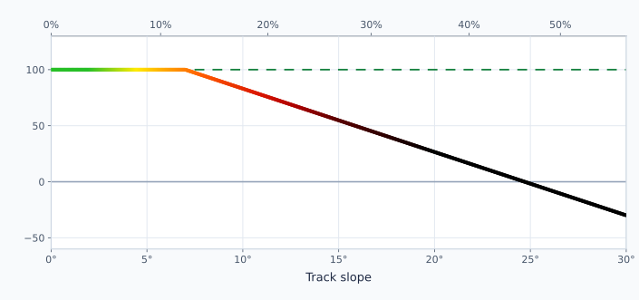
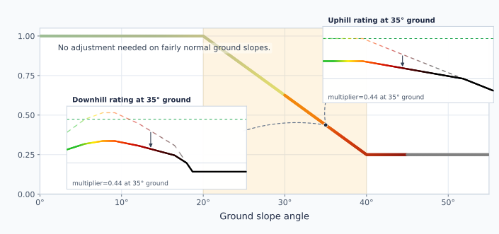
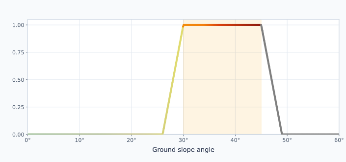

# skitur

**skitur** turns a ski touring GPX track into a single HTML report.

It is built for side-by-side route comparison. When two routes both look plausible, the report helps reveal differences in movement style, terrain steepness, and directional character.

> **Note:** USE AT YOUR OWN RISK. Winter travel involves inherent risks of injury and death. Skitur provides automated terrain analysis provided "AS IS" and "WITH ALL FAULTS" without warranties of any kind, including accuracy or fitness for a particular purpose. This software is for informational purposes only and does not constitute professional advice. This software is not a substitute for official forecasts, education, or field judgment.

## Quick start

Install:

```bash
pip install -e .
```

Generate a report:

```bash
python -m skitur Twin_Lakes.gpx -o Twin_Lakes_report.html
```

If `-o` is omitted, output defaults to `<gpx_stem>_report.html`.

## Reading the report



Terms used throughout:

- **track slope**: slope along the route itself (movement)
- **ground slope**: slope of terrain under/around the route

### Map: movement vs terrain



The map combines three layers:

- route line and color: **track slope angle** (what the skier is skiing)
- background shading: **ground slope angle** (what the terrain is doing)
- contours: terrain shape and flow

Reading them together gives quick signal:

- steep line + mellow shading usually means direct climbing/descending movement
- mellow line + steep shading usually means traversing or sidehilling
- steep line + steep shading means concentrated demanding terrain

Color scales are fixed across reports, so a given color means the same slope range every time.

### Distributions: movement split vs terrain mix




These two charts answer different questions:

- **Track slope distribution** is direction-aware (uphill vs downhill movement)
- **Ground angle distribution** is not direction-split (terrain steepness only)

### Aspect pair: direction + steepness together



Use this pair to understand directional concentration:

- **Slope by aspect** shows where steepness clusters by direction
- **Fraction on aspect** shows directional share split into &lt; 30&deg; (green) and &ge; 30&deg; (red)

A simple way to read it:

- inspect steepness concentration in **Slope by aspect**
- check total directional share in **Fraction on aspect**

Both charts allow you to view specifically >30&deg; slopes separately. Hover over a wedge for numbers.

## Where does the score come from?

At a high level:

- each segment gets movement-based ratings
- those ratings are adjusted for underlying ground steepness
- the result is combined with the avalanche exposure rating metric into one final score

### 1) Downhill track angle "fun" rating

This rating rewards controllable, skiable, thrilling downhill movement over flatter routes and very steep descents.

- gentle downhill gets credit, but not the highest rating
- moderate downhill receives the best rating
- very steep downhill falls off quickly
- once downhill angle is very steep, the rating becomes negative



### 2) Uphill track angle "doability" rating

This rating rewards sustainable climbing angles and penalizes steeper climbs.



### 3) Ground steepness multiplier

This multiplier adjusts "downhill fun" and "uphill doability" ratings by underlying terrain steepness.

On gentler ground, uphill/downhill movement keeps full credit. As ground steepness increases, ratings are scaled down. On very steep ground, only a small fraction is retained. (Negative fun and doability ratings are not adjusted.) Sidehilling sucks.



### 4) Avalanche exposure rating metric

This is a modeled exposure metric, not a field forecast.

It combines both:

- the ground you are on: percent of track on 30&deg;-45&deg; ground (30-45 degree ground)
- the ground above you: uphill tracing from the track location in 64 steps over up to 500 m, or until a ridge is detected

Slope penalties use a full 30-45 band with linear tapers at 26-30 and 45-49.



### 5) Final blend

The final score is blended as:

- 45% downhill quality
- 25% uphill quality
- 30% avalanche exposure rating metric

(After blending, the score is forced to be between 0 and 100.)
